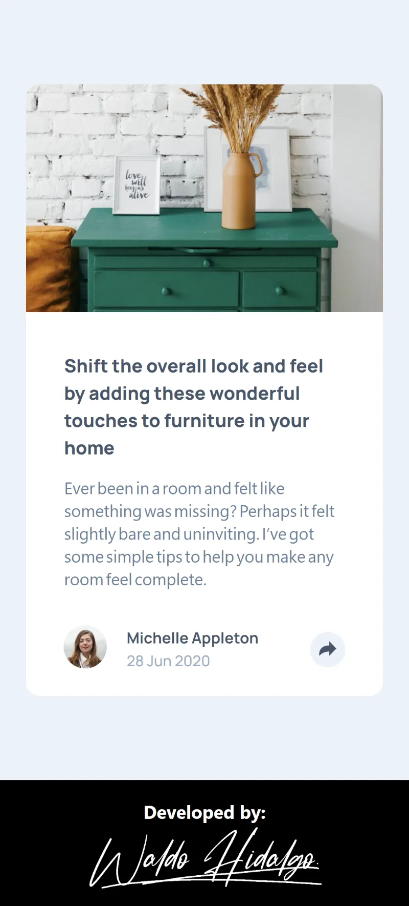
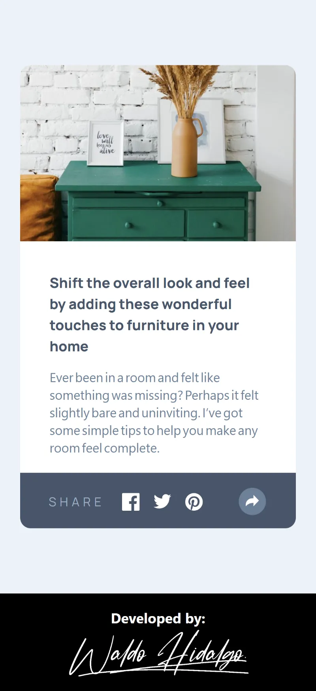
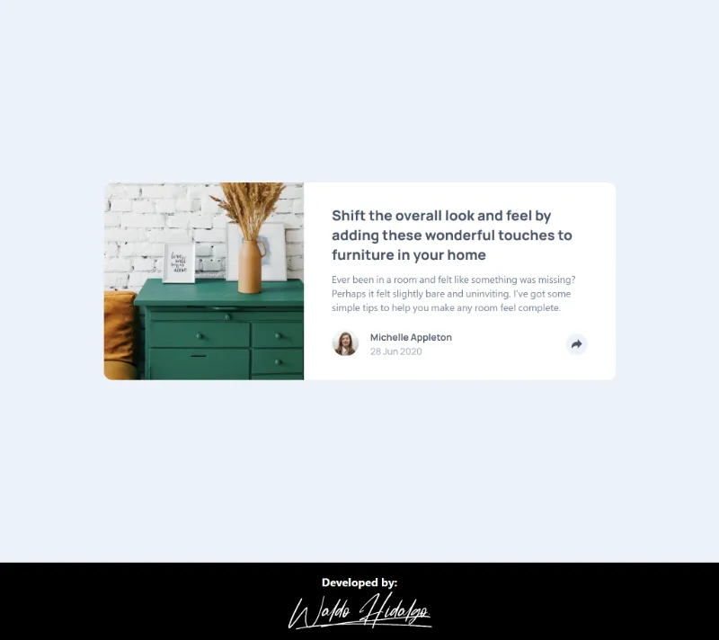
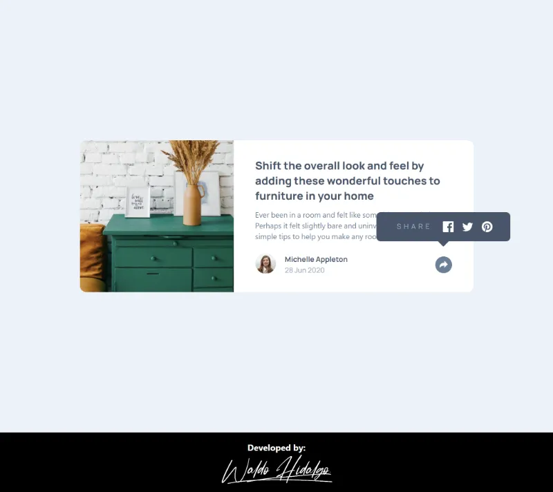

# Article preview component

Repositorio con el código solución del proyecto [Article preview component challenge on Frontend Mentor](https://www.frontendmentor.io/challenges/article-preview-component-dYBN_pYFT).

## Tabla de Contenidos

- [Article preview component](#article-preview-component)
  - [Tabla de Contenidos](#tabla-de-contenidos)
  - [The challenge](#the-challenge)
  - [Diseños a replicar](#diseños-a-replicar)
    - [1. Mobile Design](#1-mobile-design)
    - [2. Mobile Active States Design](#2-mobile-active-states-design)
    - [3.Desktop Design](#3desktop-design)
    - [4.Desktop Active States Design](#4desktop-active-states-design)
  - [Proyecto Finalizado](#proyecto-finalizado)
    - [1. Mobile Size](#1-mobile-size)
    - [2. Mobile Active States Size](#2-mobile-active-states-size)
    - [3.Desktop Size](#3desktop-size)
    - [4.Desktop Active States](#4desktop-active-states)

## The challenge

El desafío consiste en realizar lo siguiente:

> Your challenge is to build out this article preview component and get it looking as close to the design as possible.
>
> You can use any tools you like to help you complete the challenge. So if you've got something you'd like to practice, feel free to give it a go.
>
> The only JavaScript you'll need for this challenge is to initiate the share options when someone clicks the share icon.
>
> Your users should be able to:
>
> - View the optimal layout for the component depending on their device's screen size
> - See the social media share links when they click the share icon

## Diseños a replicar

### 1. Mobile Design

### 2. Mobile Active States Design

### 3.Desktop Design

### 4.Desktop Active States Design

## Proyecto Finalizado

### 1. Mobile Size

### 2. Mobile Active States Size

### 3.Desktop Size

### 4.Desktop Active States

